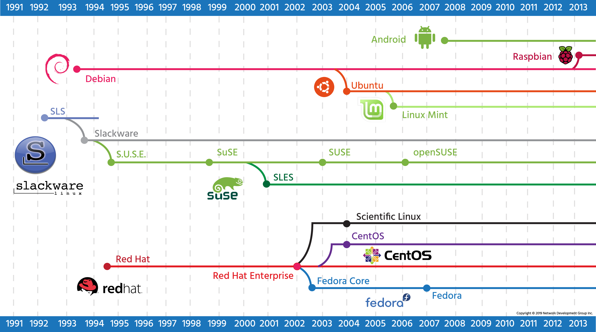

# NDG Linux Essentials (https://www.netacad.com/courses/os-it/ndg-linux-essentials)
### Info
* Course Duration : 70 Hours

## Chapter 2 - Operating Systems
* Search more on common OS for firewalls
* The generic term operating system is used to describe whatever software is booted and run on that device.
* The 3 Major OSes are Windows, Apple macOS, and Linux. Of these 3 OSes only Windows is unique in its underlying code. Both Apple's macOS and Linux are UNIX based.
* When a software release has many new features that haven’t been tested, it’s typically referred to as *beta*. After being tested in the field, its designation changes to *stable*
* Some distributions offer stable, testing, and unstable releases.
* The Debian distribution warns users about the pitfalls of using the “sid” (unstable) release
* Linux can be used in one of two ways: graphical (GUI) and non-graphical (CLI).
* The CLI environment is provided by an application on the computer known as a terminal.
* The terminal accepts what the user types and passes to a shell. 
* The shell interprets what the user has typed into instructions that can be executed by the operating system.
* the `w` command shows who is logged in.

### 2.4.1 Linux Distributions
**Red Hat**: (Fedora, CentOS, Scientific Linux)
* RPM - Red Hat Package Manager.
* RHEL - Red Hat Enterprise Linux.
**SUSE**: (OpenSUSE)
**Debian**: (Ubuntu, Linux Mint)
**Android**: 
**Raspbian**:

**Linux History**
* 
