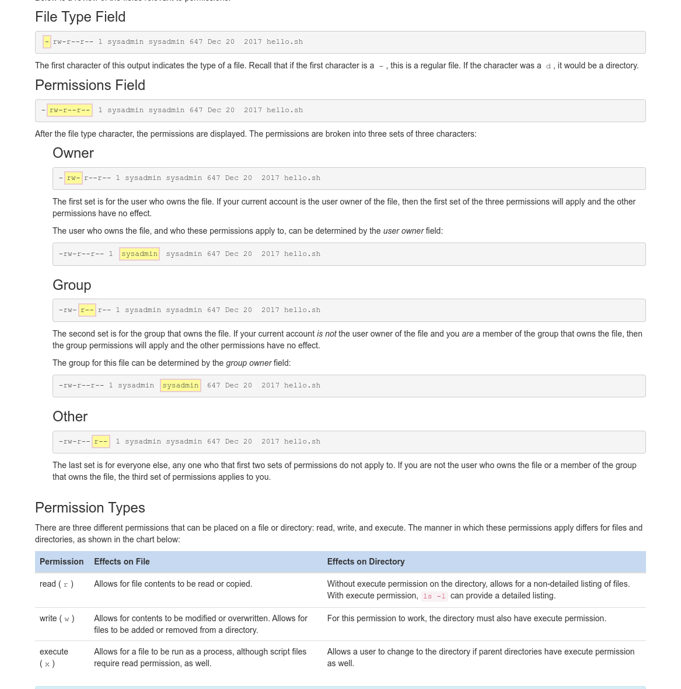

# [NDG Linux Unhatched Course](https://www.netacad.com/courses/os-it/ndg-linux-unhatched)
### Info
* Duration : 8 Hours.

## Notes
* Technical skills to analyze, process, protect, and transmit data are therefore also in high demand. Learning Linux can help you on the journey towards acquiring these skills

* Example of IT Professions includes Network Engineeering, Cybersecurity, Developing/programming, Data Analysis

### Section 2 - Basic Command Syntax
* A command is a software program that when executed on the CLI (command line interface), performs an action on the computer.
* Every part of the command is normally case-sensitive
* An argument can be used to specify something for the command to act upon.
* Options can be used to alter the behavior of a command.
* Basic command syntax is `command [options…] [arguments…]`.
    * for example `ls -l Documents`. here ls = command; -l is an option, and Documents is the argument

* Multipe Options can be given in any other and it would work the same for example 
    ```
    ls -l -r
    ls -rl 
    ls -lr 
    ``` 
    would all do the same thing. 

### Section 3 - Printing Working Directory
* In order to discover where you are currently located within the filesystem, the pwd command can be used. The `pwd` command prints the working directory, your current location within the filesystem:
### Section 4 - Changing Directories
* Files are used to store data such as text, graphics and programs. Directories are a type of file used to store other files–they provide a hierarchical organizational structure. 
* To navigate the filesystem structure, use the cd (change directory) command to change directories. 
* Syntax: `cd [options] [path]`
* the top directory of the linux system (root directory)is represented by the `/` (forward-slash) character while the home (user) directory is represented by `~` (tilda) character
* There are two types of parts 
    1. Absolute paths : allows you to specify the exact location of a directory. It always starts at the root directory, therefore it always begins with the / character. e.g `cd /home/user/Desktop` is an absolute path.
    2. Relative paths : gives direction to afile relative to your current location in the filesystem. They start with the name of a directory and not with the / character.e.g `cd Documents`
* Regardless of which directory you are in, `..` always represents one directory higher relative to the current directory, sometimes referred to as the parent directory. 
* Regardless of which directory you are in, the `.` character always represents your current directory.

### Section 5 - Listing Files
* The ls command is used to list the contents of a directory. 
* Syntax: `ls [OPTIONS] [FILE]`. By default, when the ls command is used with no options or arguments, it will list the files in the current directory.
* To learn the details about a file, such as the type of file, the permissions, ownerships or the timestamp, perform a long listing using the `-l ` option to the `ls `command. e.g `ls -l /var/log`
    ```
    -rw-r--r-- 1 root   root  18047 Dec 20  2017 alternatives.log       
            
    drwxr-x--- 2 root   adm    4096 Dec 20  2017 apache2 
    ```
    * 

#### Sorting With ls
* `-t` option will sort the files by timestamp.
* `-S` option will sort the files by size.
* `-r` option will sort the files in reverse order.

### Section 6 - Administrative Access.
* Logging in as the root user provides administrative access, allowing for the execution of some of the privileged commands. 
* The `su` command allows you to temporarily act as a different user. It does this by creating a new shell. The shell is simply a text input console that lets you type in commands. By default, if a user account is not specified, the `su` command will open a new shell as the root user, which provides administrative privileges.
* The `sudo` command allows a user to execute a command as another user without creating a new shell. Instead, to execute a command with administrative privileges, use it as an argument to the `sudo` command. Like the `su` command, the sudo command assumes by default the root user account should be used to execute commands.

### Section 7 - Permissions
* Permissions determine the ways different users can interact with a file or directory. When listing a file with the `ls -l` command, the output includes permission information.
* 

### Section 8 - Changing File Permissions
* The `chmod` command is used to change the permissions of a file or directory. Only the root user or the user who owns the file is able to change the permissions of a file.
* Permissions used to be referred to as modes of access, so the command chmod really means change the modes of access.
* There are two techniques for changing permissions with the chmod command: symbolic and octal. The symbolic method is good for changing one set of permissions at a time. The octal or numeric method requires knowledge of the octal value of each of the permissions and requires all three sets of permissions (user, group, other) to be specified every time. 
#### The Symbolic Method.
`chmod [<SET><ACTION><PERMISSION>]... FILE`
* 

### Section 9 - Changing File Ownership
* Initially, the owner of a file is the user who creates it. The chown command is used to change the ownership of files and directories. Changing the user owner requires administrative access. A regular user cannot use this command to change the user owner of a file, even to give the ownership of one of their own files to another user. However, the chown command also permits changing group ownership, which can be accomplished by either root or the owner of the file.
* Syntax to change ownership `chown [OPTIONS] [OWNER] FILE` e.g `sudo chown root hello.sh`

### Section 10 - Viewing Files Content
* The `cat` command, which stands for “concatenate”, is often used to quickly view the contents of small files. Basic syntax `cat [Options] [File]`. e.g `cat file.txt`.
* pager commands include `less` and `more` they can be used as better alternative to cat for viewing text file.
* The `head` commmand is use to view the top lines of a file. 
* Syntax `head [OPTIONS] [FILE]` e.g `head file.txt`.
* The `tail` command is used to view the bottom lines of a file.
* Syntax `tail [OPTION] [FILE]` e.g `tail file.txt`.

### Section 11 - Copying Files
* The `cp` command is used to copy files. Similar to the mv command, it requires at least two arguments: a source and a destination. 
* Syntax `cp [OPTION] SOURCE DESTINATION`
* The `dd` command is a utility for copying files or entire partitions at the bit level. Syntax `dd [OPTIONS] OPERAND`
    * It can be used to clone or delete (wipe) entire disks or partitions.
    * It can be used to copy raw data to removable devices, such as USB drives and CDROMs.
    * It can backup and restore the MBR (Master Boot Record).
    * It can be used to create a file of a specific size that is filled with binary zeros, which can then be used as a swap file (virtual memory).

### Section 12 - Moving Files
* The `mv` command is used to move a file from one location in the filesystem to another. 
* Syntax : `mv SOURCE DESTINATION`. The source or destination can be a file or folder.
* The `mv` command requires at least two arguments. The first argument is the source, a path to the file to be moved. The second argument is the destination, a path to where the file will be moved to. 
* The `mv` command is able to move multiple files, as long as the final argument provided to the command is the destination.
* Moving a file within the same directory is an effective way to rename it.

### Section 13 - Removing Files
* The `rm` command is used to delete files and directories. It is important to keep in mind that deleted files and directories do not go into a "trash can", it is parmanently deleted.
* Basic Syntax: `rm [OPTIONS] FILE`
* Use `-r` or `-R` with the `rm` command to remove directories recursively.

### Section 14 - Filtering Inputs
* The `grep` command is a text filter that will search input and return lines which contain a match to a given pattern.
* Syntax `grep [OPTIONS] PATTERN [FILE]`

#### Regular Expressions
* Regular expressions have two common forms: basic and extended. Most commands that use regular expressions can interpret basic regular expressions. However, extended regular expressions are not available for all commands and a command option is typically required for them to work correctly.
* 

### Section 15 - Shutting Down
* The `shutdown` command arranges for the system to be brought down in a safe way. All logged in users are notified that the system is going down and within the las five minutes leading up to shutdown, new logins are prevented.
* Syntax: `shutdown [OPTIONS] TIME [MESSAGE]`

### Section 16 - Network Configuration
* The `ifconfig` command stands for interface configuration and is used to display network configuration infomation.
* Syntax: ifconfig [OPTIONS]
* The `iwconfig` command is similar to the ifconfig command, but it is dedicated to wireless network interfaces.
* The `ping` command is used to verify connectivity between two computers. It does this by sending packets to another machine on a network. If the sender receives a response it should be possible to connect to that machine.

### Section 17 - View Processes.
* Running a command results in something called a process. In the Linux operating system, processes are executed with the privileges of the user who executes the command. This allows for processes to be limited to certain capabilities based upon the user identity.
* Syntax: `ps [OPTIONS]` e.g `ps -e` shows all processes running not limited to the current user's process. `-f` option provide more information about the processes.

### Section 18 - Package Management.
* Package management is a system by which software can be installed, updated, queried or removed from a filesystem. 
* At the lowest level of the Debian package management system is the `dpkg` command. This command can be tricky for novice Linux users, so the Advanced Package Tool, `apt-get` or just `apt`, a front-end program to the `dpkg` tool, makes management of packages even easier. *A front-end program is a program that users can see and interact with.*
#### Installing Packages
* Before installing a package, it is good practice to refresh the list of available packages using the `apt-get update` or `apt update` command. 
* *Many of the package management commands require administrative access, so they will be prefaced with the `sudo` command*
* To search for keywords within these packages, you can use the `apt-cache search [keyword]`
* To install a package `sudo apt install [package]` or `sudo apt-get install package`
* To update packages `sudo apt update` or `sudo apt-get update` then do a `sudo apt upgrade` if updates are available. do a `sudo apt dist-upgrade` of kernel/distribution updates are available.
#### Removing Packages
* The `apt-get` command is able to either `remove` or `purge` a package. The difference between the two is that purging deletes all package files, while removing deletes all but the configuration files for the package.
* Syntax `sudo apt remove [package]` or `sudo apt-get remove [package]`
* For purge `sudo apt purge [package]` or `sudo apt-get purge [package]`

### Section 19 - Updateing User Passwords
* The `passwd` command is used to update a user's password. Users can only change their own passwords, whereas the root can update the password for any user.
* Syntax: `passwd [OPTIONS] [USER]`
* Run: `passwd` to change password for the current user.
* Run: `passwd -S user` to view status info about user password.

    

### Section 20 - Redirections


